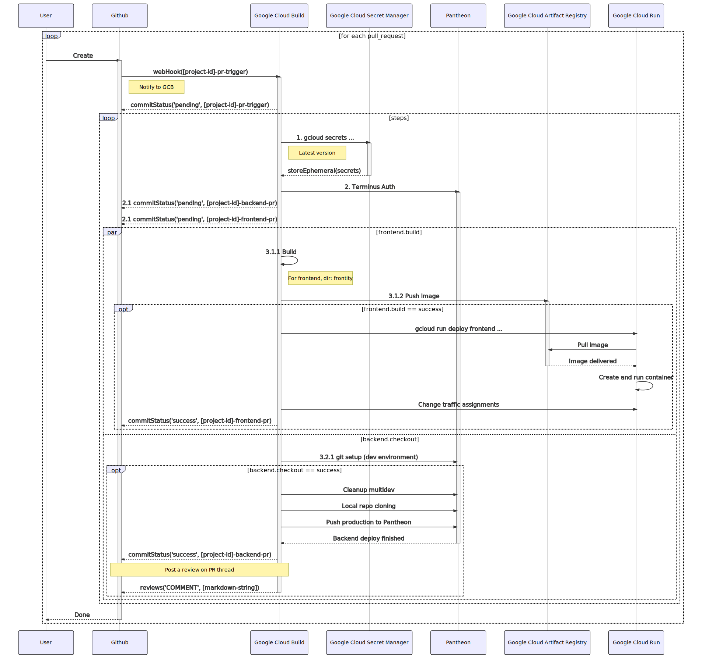
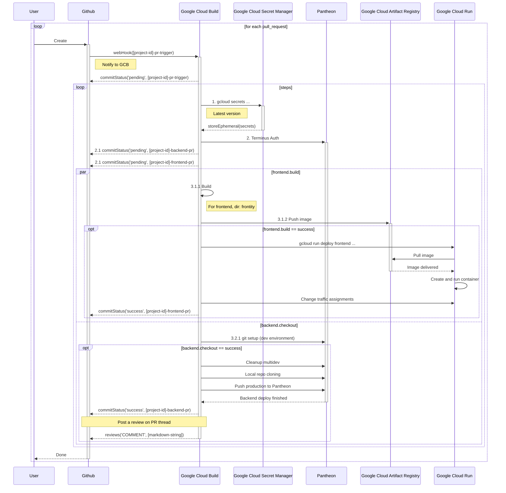
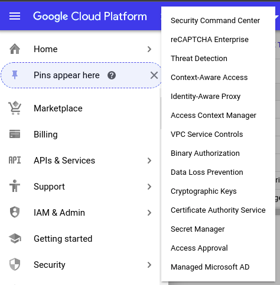
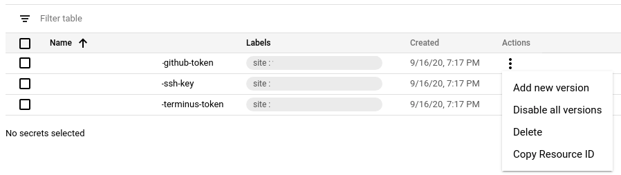
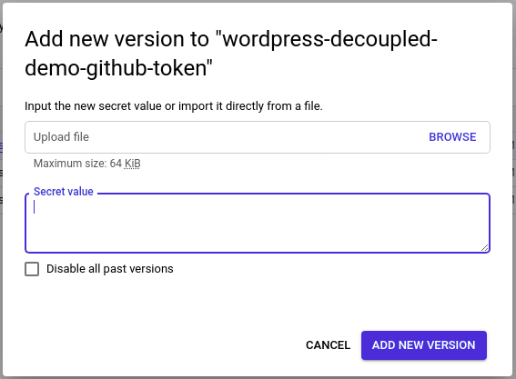
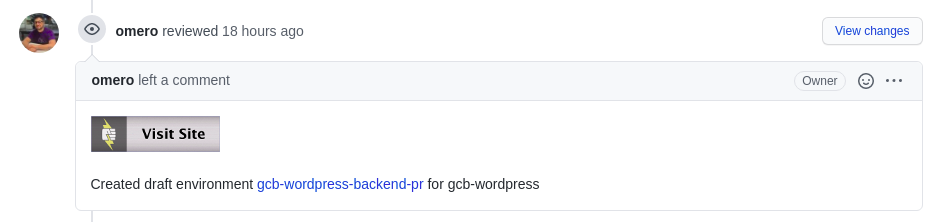
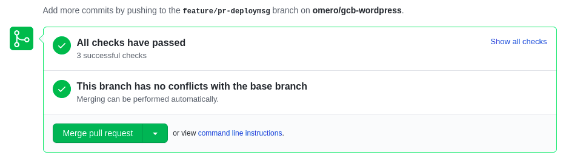
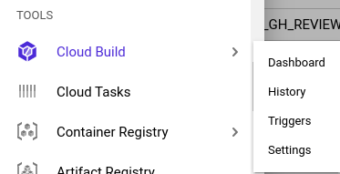
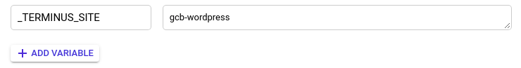

# Title TBD <!-- omit in toc -->

- [Introduction](#introduction)
- [Prerequisites](#prerequisites)
- [Infrastructure overview](#infrastructure-overview)
- [Sequence diagram](#sequence-diagram)
- [Secrets setup](#secrets-setup)
- [Frontend CI/CD process](#frontend-cicd-process)
- [Proposed changes to terraform project](#proposed-changes-to-terraform-project)

## Introduction

This architectural reference should help a Proffesional Services Pantheor on how to configure a Frontity-based monorepo project, using Github as a VCS.

- You can take a look on the [wordpress-decoupled-demo](https://github.com/pantheon-systems/wordpress-decoupled-demo) repository to get a fresh start on the specific type of web projects to be deployed using this formula

## Prerequisites

- Good understanding of **terraform** (You should look the [gce-terraform-decoupled](https://github.com/pantheon-systems/gce-terraform-decoupled/) repository, where the latest reference on opinionated creation of GCP infrastructure is referenced. Pay attention to `projects/wordpress-decoupled-demo` for a concrete example)
- A **pantheon.io** Google account with the following associated roles on Google Cloud:
  - `roles/viewer`
  - `roles/secretmanager.admin`
- Have a **Github repository** configured according to [Adding new customer project][1]

## Infrastructure overview

As a whole, the solution should create/update the following GCP resources:

- An Artifact Registry Docker repository
- A Cloud Run Service (based on the image submitted to Artifact Registry)

We'll use the following resources to provision the aforementioned Cloud Run Service:

- Two Cloud Build triggers (as described in [Adding new customer project][1])
  - Note that the file to be read on each trigger differs when doing a PR or a push event. (By default, `pr-build.yaml` and `main-build.yaml` respectively)

Also, you should provide manually the following secrets (procedure described below):

- `[project-id]-github-token`
- `[project-id]-ssh-key`
- `[project-id]-terminus-token`

## Sequence diagram

The following diagram should help to understand the flow logic behind the construction of a Frontity project on GCP. 

Show the mermaid code

## Secrets setup

> Note: This is a manual process that must be done before even trying to run a Pull Request over the project. Failure to do so results in Google Cloud Build triggers general failure

1. Navigate through the [Google Cloud Console](https://console.cloud.google.com). Locate **Security** on the Navigation menu at left. Then select **Secret Manager**

2. The related secrets should be labeled with the `frontend_site` variable, defined in the corresponding terraform project. You should add a new version of those secrets over the *Actions* menu > *Add new version*

3. On the appearing popup, fill the new **secret value**:

## Frontend CI/CD process

We use the codebase located in `frontity` folder to deploy a Cloud Run service, taking advantage of Pull Request number to allocate its corresponding URL. For example, if we're doing a Pull Request with ID #5, the Cloud Build configuration file will provision the following resources:

- A new site on *.pantheonsite.io, with a hostname value of `pr-[#id]-[project-name]`

Once Google Cloud Builds finishes the Frontend Deployment, it should add a review over the recently opened PR, as shown in the following image:

Once Cloud Build finishes the whole process, you should look for the three checks on succesful state:

## Proposed changes to terraform project

To work properly, we need to add a new variable on the respective terraform project. Here will be shown the process for manual creation, that should be adapted to the corresponding Infrastructure repository:

1. Navigate through the [Google Cloud Console](https://console.cloud.google.com). Locate **Cloud Build** on the Navigation menu at left. Then select **Triggers**

2. Identify the **Add variable** button and click it.

3. Create `_GH_REVIEW_URL` with a value of `$(pull_request.pull_request.url)/reviews`.

[1]: https://github.com/pantheon-systems/gce-terraform-decoupled/blob/master/docs/adding-new-projects.md